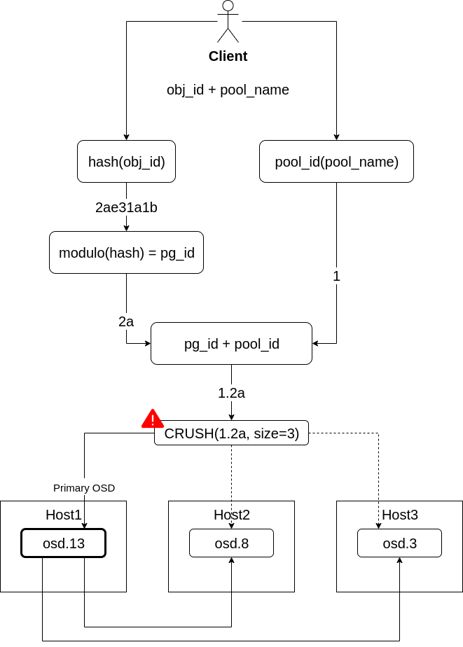

**Still under construction.**

# general

| command | description |
|-|-|
| `ceph -s` ||
| `ceph -w` ||
| `ceph health detail` ||
| `ceph -s -f json` ||
| `ceph df` ||
| `rados df` ||
| `ceph osd tree` ||
| `ceph osd df tree` ||

| command | description |
|-|-|
| `systemctl status ceph-mon@$hostname` ||
| `systemctl status ceph-osd@$osd_id` ||
| `systemctl status ceph-radosgw@$rgw.$hostname` ||

# pools

| command | description |
|-|-|
| `ceph osd pool ls detail` | list all pools incl parameters |
| `ceph osd pool stats` | list all io on the pools |
| `ceph osd pool create data 64` | create a pool `data` with 64 pgs |
| `ceph osd pool create ec_data 64 erasure` | create a pool `ec_data` with 64 pgs with erasure code |
| `ceph osd pool set $name min_size $size` | set the min_size for the pool $name to $size |
| `ceph osd erasure-code-profile set rack84 k=8 m=4 crush-failure-domain=rack` | create a new EC profile with 8+4 and rack as failure domain |
| `ceph osd pool create backup 64 erasure rack84` | create a pool `backup` with 64 pgs with erasure code and `rack84` as profile |
| `ceph osd pool application enable backuo cephfs` | set `cephfs` as application on the pool backup |

# pgs

| command | description |
|-|-|
| `ceph pg stat` ||
| `ceph pg ls` ||
| `ceph pg dump` ||
| `ceph pg $pgid query` ||
| `ceph pg map $pgid` ||
| `ceph pg repair $pgid` ||
| `ceph osd map $poolname $obj-name` ||

# osds

| command | description |
|-|-|
| `ceph osd set $flag` | e.g. noout or norebalance |
| `ceph osd perf` ||
| `ceph osd metadata $osdid` ||
| `ceph osd find $osdid` ||
| `ceph osd down $osdid` ||
| `ceph osd in $osdid` ||
| `ceph osd destroy $osdid` ||
| `ceph osd purge $osdid` ||
| `ceph osd pause|unpause` ||
| `ceph osd blacklist add $clientip` ||
| `ceph osd reweight $osdid $float` | set a reweight (0..1) for a osd - don't mix that with the next cmd (!!!!!^111) |
| `ceph osd crush reweight $osdid $float` | set a new weight for a osd - usally the disk size. |

# cephx

| command | description |
|-|-|
| `ceph auth get-or-create client.$user mon '$mon_caps' osd '$ods_caps' mds '$mds_caps'` ||
| `ceph auth get-key client.$user` | shows only the key for client.$user |
| `ceph auth caps client.$user mon '$mon_caps' osd '$ods_caps' mds '$mds_caps'` | modify the caps for client.$user |

#### Restore a lost `ceph.client.admin.keyring`

`[root@ceph-mon]# ceph -n mon. -k /var/lib/ceph/mon/ceph-$hostname/keyring auth export client.admin`

# rbd

| command | description |
|-|-|
| `rbd create --size $size $name` ||